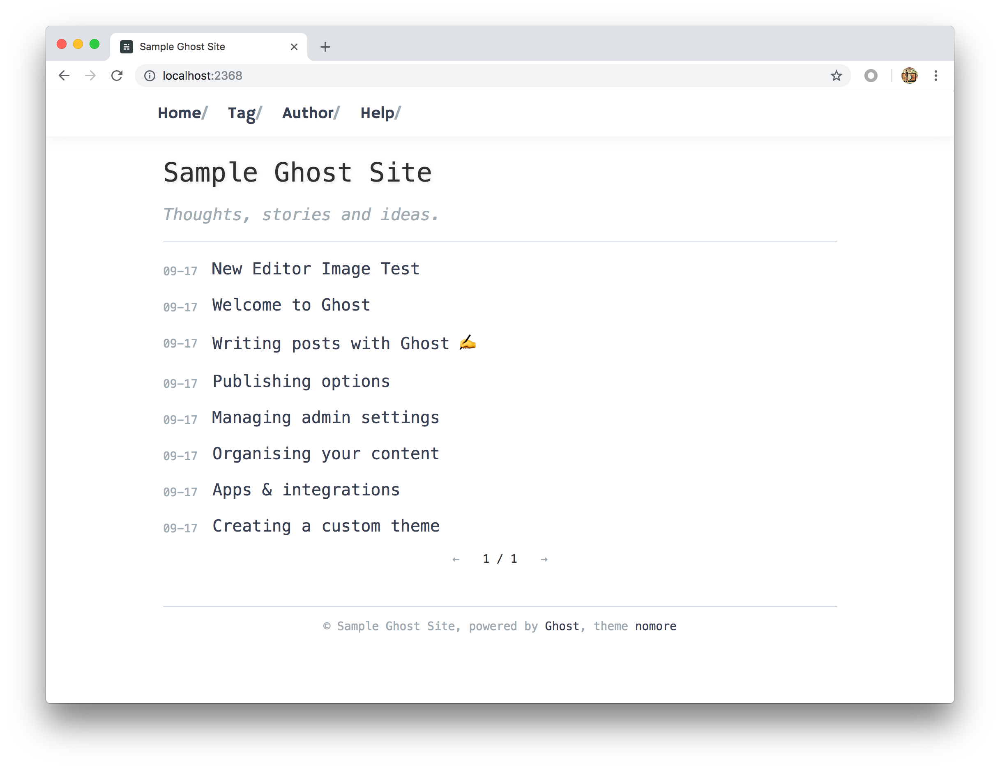

# Ghost 主题 nomore

一个简洁的同时又美观耐看不普通的 Ghost 主题，适合开发者个人博客

## Featrue List

*   移动端优化
*   中文显示友好
*   代码高亮（使用 highligh.js 若需要支持更多冷门语言，请 clone 后修改配置重新 build）
*   支持的 Ghost 页面：index,post,tag,author,page
*   文章页面图片支持点击缩放（使用 zoom.js）

## 预览 Preview

### Online Web

[Ruofeng's Blog](https://ruofeng.me)

### Home 主页文章列表



### Post 文章页面


## Usage 使用方法

### Upload Theme 上传并激活主题

1.  在[Release](https://github.com/abowloflrf/nomore/releases)中下载最新的 zip 主题压缩包

2.  Ghost 后台上床并激活主题：


### Dev Guide 开发指南

```
git clone https://github.com/abowloflrf/nomore
cd nomore
npm install
npm run prod
```
